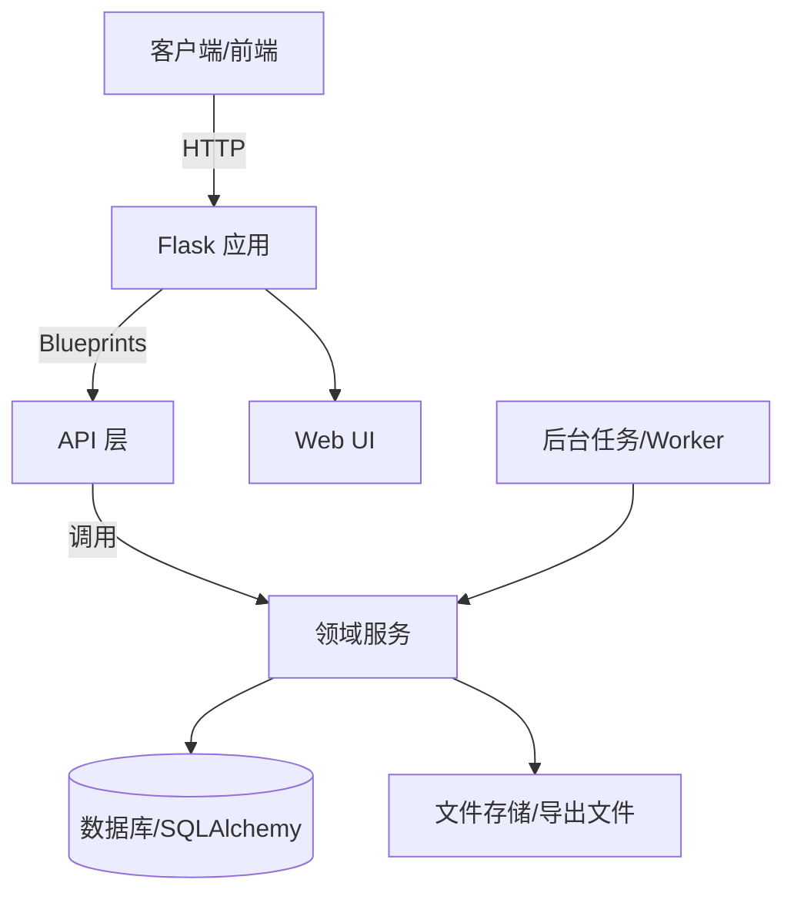

# zbwj-demo

## 项目简介
本项目是一个基于 Flask 的知识库/索引检索服务示例，提供文件与任务管理、知识库文档导入与检索、索引检索等 API，并提供基础的 Web UI 入口。应用通过 `create_app` 初始化配置与扩展，并注册多组 API Blueprint（health、files、jobs、prompt scripts、index、kb、review index 等）。【F:app/__init__.py†L1-L52】

## 主要能力
- **健康检查**：提供 `/api/health` 便于服务探活。【F:app/api/health.py†L1-L8】
- **索引检索**：提供 `/api/v1/index/search` 用于索引查询与分页排序等参数处理。【F:app/api/v1/index.py†L1-L33】
- **知识库导入与检索**：支持知识库文档导入、列表、删除、检索与导出（docx）。【F:app/api/v1/kb.py†L1-L99】
- **数据模型**：包含文件、任务、证据、知识库文档与块等核心模型，使用 SQLAlchemy 管理。【F:app/models.py†L1-L170】

## 代码结构
- `run.py`：本地启动入口，读取环境变量并启动 Flask 应用。【F:run.py†L1-L10】
- `app/`：应用层（Flask App、Blueprint、服务与扩展）。【F:app/__init__.py†L1-L52】
- `domain/`：领域层（索引检索、知识库导入/检索/导出等）。【F:domain/kb/ingest.py†L1-L200】
- `migrations/`：数据库迁移。
- `tests/`：测试用例。

## 代码架构示意图

> 上图展示了请求从客户端进入 Flask 应用，经过 API 层调用领域服务，最终落到数据库或文件存储，并可由后台任务驱动处理流程。对应实现可参考 `app/` 与 `domain/` 目录结构。【F:app/__init__.py†L1-L52】
