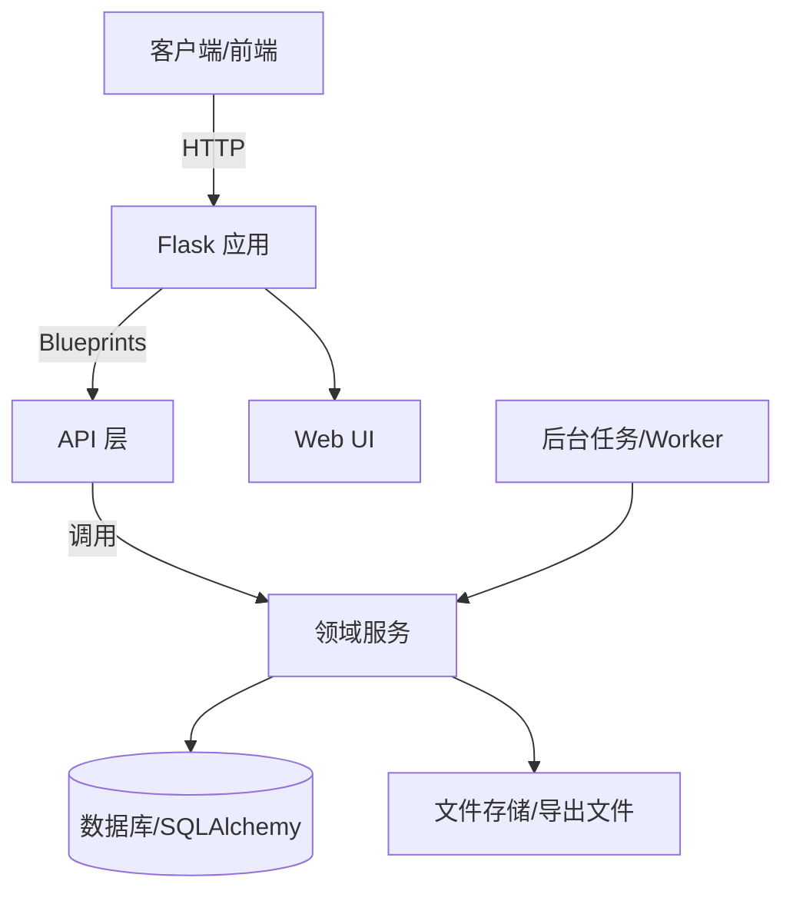

# zbwj-demo

## 项目简介
本项目是一个基于 Flask 的知识库/索引检索服务示例，提供文件与任务管理、知识库文档导入与检索、索引检索等 API，并提供基础的 Web UI 入口。应用通过 `create_app` 初始化配置与扩展，并注册多组 API Blueprint（health、files、jobs、prompt scripts、index、kb、review index 等）。【F:app/__init__.py†L1-L52】

## 主要能力
- **健康检查**：提供 `/api/health` 便于服务探活。【F:app/api/health.py†L1-L8】
- **索引检索**：提供 `/api/v1/index/search` 用于索引查询与分页排序等参数处理。【F:app/api/v1/index.py†L1-L33】
- **知识库导入与检索**：支持知识库文档导入、列表、删除、检索与导出（docx）。【F:app/api/v1/kb.py†L1-L99】
- **评审办法索引**：读取结果表与评分模板，生成评审索引 Word 文档。【F:app/api/v1/review_index.py†L1-L94】
- **数据模型**：包含文件、任务、证据、知识库文档与块等核心模型，使用 SQLAlchemy 管理。【F:app/models.py†L1-L170】

## 代码结构
- `run.py`：本地启动入口，读取环境变量并启动 Flask 应用。【F:run.py†L1-L10】
- `app/`：应用层（Flask App、Blueprint、服务与扩展）。【F:app/__init__.py†L1-L52】
- `domain/`：领域层（索引检索、知识库导入/检索/导出、模板注册等）。【F:domain/kb/ingest.py†L1-L247】
- `migrations/`：数据库迁移（Alembic）。【F:migrations/env.py†L1-L52】
- `tests/`：测试用例（pytest/ unittest）。【F:tests/test_kb_export.py†L1-L154】【F:test_index_search.py†L1-L133】

## 代码架构示意图

> 上图展示了请求从客户端进入 Flask 应用，经过 API 层调用领域服务，最终落到数据库或文件存储，并可由后台任务驱动处理流程。对应实现可参考 `app/` 与 `domain/` 目录结构。【F:app/__init__.py†L1-L52】

## 文件说明（逐文件说明 + 可删建议）
> 说明：以下清单按仓库 **已跟踪文件** 列出。带“可删”的一般是运行/脚本产物或缓存文件；删掉后会自动重新生成或仅影响样例数据。

### 顶层文件
- `README.md`：项目说明文档（本文）。
- `run.py`：Flask 启动入口，读取环境变量并启动 `create_app`。【F:run.py†L1-L10】
- `bulk_kb_result.jsonl`：批量 KB 导入脚本输出的结果日志（jsonl）。可删（可重新生成）。【F:bulk_kb_result.jsonl†L1】
- `kb_ingest_offline.jsonl`：离线 KB 切片脚本输出的结果日志（jsonl）。可删（可重新生成）。【F:kb_ingest_offline.jsonl†L1】
- `kb_offline_build.jsonl`：离线 KB 构建脚本输出的结果日志（jsonl）。可删（可重新生成）。【F:kb_offline_build.jsonl†L1】
- `downloaded_result.json`：示例/下载得到的任务结果 JSON。可删（仅样例数据）。【F:downloaded_result.json†L1-L20】
- `downloaded_result.xlsx`：示例/下载得到的任务结果 Excel。可删（仅样例数据，需重新生成）。
- `test_index_search.py`：索引检索 API 的 unittest 测试脚本。【F:test_index_search.py†L1-L133】
- `test_kb_ingest.py`：KB 导入/检索/删除的 unittest 测试脚本。【F:test_kb_ingest.py†L1-L120】

### app/（应用层）
- `app/__init__.py`：创建 Flask App、加载配置、初始化扩展并注册 Blueprint。【F:app/__init__.py†L1-L52】
- `app/config.py`：配置类与数据库连接选择逻辑（MySQL/SQLite）。【F:app/config.py†L1-L56】
- `app/extensions.py`：Flask 扩展实例（SQLAlchemy、Migrate、CORS）。【F:app/extensions.py†L1-L7】
- `app/models.py`：SQLAlchemy 数据模型定义（File、Job、Evidence、KbDocument 等）。【F:app/models.py†L1-L170】
- `app/seed.py`：初始化 `document_types` 基础数据的种子脚本。【F:app/seed.py†L1-L61】

#### app/api/（API 层）
- `app/api/files.py`：文件上传 API（/api/v1/files/upload）。【F:app/api/files.py†L1-L39】
- `app/api/health.py`：健康检查 API（/api/health）。【F:app/api/health.py†L1-L8】
- `app/api/jobs.py`：任务创建/查询/结果下载 API（/api/v1/jobs）。【F:app/api/jobs.py†L1-L104】
- `app/api/prompt_scripts.py`：列出 prompt scripts 的 API。【F:app/api/prompt_scripts.py†L1-L16】
- `app/api/root.py`：根路径 `/` 的简易服务信息与入口提示。【F:app/api/root.py†L1-L16】
- `app/api/init.py`：包初始化文件（空文件，仅用于包标识）。

#### app/api/v1/（V1 API）
- `app/api/v1/index.py`：证书索引检索 API（search）。【F:app/api/v1/index.py†L1-L33】
- `app/api/v1/kb.py`：知识库导入/检索/导出 API。【F:app/api/v1/kb.py†L1-L99】
- `app/api/v1/review_index.py`：评审办法索引预览与生成 API。【F:app/api/v1/review_index.py†L1-L94】
- `app/api/v1/init.py`：包初始化文件（空文件，仅用于包标识）。

#### app/services/（服务层）
- `app/services/file_service.py`：保存上传文件并写入 `files` 表。【F:app/services/file_service.py†L1-L71】
- `app/services/job_service.py`：创建任务记录、读取任务状态。【F:app/services/job_service.py†L1-L90】
- `app/services/prompt_registry.py`：加载/校验 prompt script JSON 文件。【F:app/services/prompt_registry.py†L1-L90】
- `app/services/cert_storage.py`：证书图片存储、去重、证据记录创建逻辑。【F:app/services/cert_storage.py†L1-L244】
- `app/services/init.py`：包初始化文件（空文件，仅用于包标识）。

#### app/prompt_scripts/（prompt 脚本）
- `app/prompt_scripts/demo_v1.json`：示例脚本定义，包含模板引用与 Excel 输出结构。【F:app/prompt_scripts/demo_v1.json†L1-L22】
- `app/prompt_scripts/2.json`：历史/样例数据结构（非标准脚本格式）。可删（如不使用）。【F:app/prompt_scripts/2.json†L1-L27】
- `app/prompt_scripts/tender_extract_v1.json`：空文件，占位用。可删（不影响功能）。

#### app/web/ 与 templates/（简单 UI）
- `app/web/ui.py`：`/ui` 路由，渲染 `ui.html`。【F:app/web/ui.py†L1-L8】
- `app/web/init.py`：与 `ui.py` 内容重复，当前未被引用。可删（不影响功能）。【F:app/web/init.py†L1-L8】
- `app/templates/ui.html`：前端演示页面（证书检索 + KB 检索/导出）。【F:app/templates/ui.html†L1-L200】

#### app/worker/（任务执行）
- `app/worker/runner.py`：内置任务执行器（解析文件、抽取、导出结果）。【F:app/worker/runner.py†L1-L246】
- `app/worker/components/parser.py`：解析 txt/docx 文本（含 docx 解析兜底）。【F:app/worker/components/parser.py†L1-L47】
- `app/worker/components/extractor.py`：规则抽取器（模拟 LLM 输出结构）。【F:app/worker/components/extractor.py†L1-L132】
- `app/worker/components/excel_exporter.py`：将抽取结果导出为 Excel。【F:app/worker/components/excel_exporter.py†L1-L58】
- `app/worker/components/init.py`：包初始化文件（空文件，仅用于包标识）。
- `app/worker/init.py`：包初始化文件（空文件，仅用于包标识）。

#### app/__pycache__/ 与 app/**/__pycache__/*.pyc
以下是 Python 运行时自动生成的字节码缓存，可删（会自动重建）：
- `app/__pycache__/__init__.cpython-39.pyc`
- `app/__pycache__/config.cpython-39.pyc`
- `app/__pycache__/extensions.cpython-39.pyc`
- `app/__pycache__/models.cpython-39.pyc`
- `app/__pycache__/seed.cpython-39.pyc`
- `app/api/__pycache__/files.cpython-39.pyc`
- `app/api/__pycache__/health.cpython-39.pyc`
- `app/api/__pycache__/jobs.cpython-39.pyc`
- `app/api/__pycache__/prompt_scripts.cpython-39.pyc`
- `app/api/__pycache__/root.cpython-39.pyc`
- `app/api/v1/__pycache__/index.cpython-39.pyc`
- `app/api/v1/__pycache__/kb.cpython-39.pyc`
- `app/api/v1/__pycache__/review_index.cpython-39.pyc`
- `app/services/__pycache__/cert_storage.cpython-39.pyc`
- `app/services/__pycache__/file_service.cpython-39.pyc`
- `app/services/__pycache__/job_service.cpython-39.pyc`
- `app/services/__pycache__/prompt_registry.cpython-39.pyc`
- `app/web/__pycache__/ui.cpython-39.pyc`
- `app/worker/__pycache__/runner.cpython-39.pyc`
- `app/worker/components/__pycache__/excel_exporter.cpython-39.pyc`
- `app/worker/components/__pycache__/extractor.cpython-39.pyc`
- `app/worker/components/__pycache__/parser.cpython-39.pyc`

### domain/（领域层）
- `domain/index/service.py`：证书索引检索的核心查询与排序逻辑。【F:domain/index/service.py†L1-L205】
- `domain/index/init.py`：包初始化文件（空文件，仅用于包标识）。
- `domain/kb/ingest.py`：KB 文档切片/入库、列表、删除逻辑（含离线模式）。【F:domain/kb/ingest.py†L1-L277】
- `domain/kb/retriever.py`：KB 块检索与排序逻辑。【F:domain/kb/retriever.py†L1-L92】
- `domain/kb/export.py`：KB 检索结果导出为 docx 的流程。【F:domain/kb/export.py†L1-L77】
- `domain/kb/exporter.py`：简化版 KB 导出实现（写入 instance/kb_storage）。【F:domain/kb/exporter.py†L1-L83】
- `domain/kb/offline_builder.py`：离线 docx 切片入库与块文件生成。【F:domain/kb/offline_builder.py†L1-L176】
- `domain/kb/__init__.py`：包初始化文件（说明性注释）。【F:domain/kb/__init__.py†L1】
- `domain/exports/word.py`：按模板导出 Word（组装 KB 块内容）。【F:domain/exports/word.py†L1-L132】
- `domain/exports/__init__.py`：包初始化文件（说明性注释）。【F:domain/exports/__init__.py†L1】
- `domain/review_index/requirements.py`：读取结果表（xlsx）并结构化为需求条目。【F:domain/review_index/requirements.py†L1-L68】
- `domain/review_index/score_template.py`：解析评分模板 docx 表格结构。【F:domain/review_index/score_template.py†L1-L120】
- `domain/review_index/kb_evidence.py`：从 KB 中召回证据块并生成摘录。【F:domain/review_index/kb_evidence.py†L1-L123】
- `domain/review_index/generator.py`：组合评分模板 + KB 证据生成评审索引 docx。【F:domain/review_index/generator.py†L1-L200】
- `domain/templates/registry.py`：模板注册/读取/校验逻辑（yaml/json）。【F:domain/templates/registry.py†L1-L170】
- `domain/templates/registry/tender_reuse_v1.yaml`：示例模板定义（招标复用模板）。【F:domain/templates/registry/tender_reuse_v1.yaml†L1-L16】

#### domain/**/__pycache__/*.pyc
以下为 Python 字节码缓存，可删（会自动重建）：
- `domain/exports/__pycache__/__init__.cpython-39.pyc`
- `domain/exports/__pycache__/word.cpython-39.pyc`
- `domain/index/__pycache__/service.cpython-39.pyc`
- `domain/kb/__pycache__/__init__.cpython-39.pyc`
- `domain/kb/__pycache__/export.cpython-39.pyc`
- `domain/kb/__pycache__/exporter.cpython-39.pyc`
- `domain/kb/__pycache__/ingest.cpython-39.pyc`
- `domain/kb/__pycache__/offline_builder.cpython-39.pyc`
- `domain/kb/__pycache__/retriever.cpython-39.pyc`
- `domain/review_index/__pycache__/generator.cpython-39.pyc`
- `domain/review_index/__pycache__/kb_evidence.cpython-39.pyc`
- `domain/review_index/__pycache__/requirements.cpython-39.pyc`
- `domain/review_index/__pycache__/score_template.cpython-39.pyc`
- `domain/templates/__pycache__/registry.cpython-39.pyc`

### instance/（运行时实例数据）
- `instance/config.py`：本机私有配置（数据库连接等）。建议本地保留但别提交到 Git。【F:instance/config.py†L1-L6】
- `instance/app.db`：默认 SQLite 数据库文件（运行时生成）。可删（会重建，但会丢数据）。

### migrations/（数据库迁移）
- `migrations/alembic.ini`：Alembic 配置文件。【F:migrations/alembic.ini†L1-L30】
- `migrations/env.py`：Alembic 迁移环境（读取 Flask SQLAlchemy metadata）。【F:migrations/env.py†L1-L52】
- `migrations/script.py.mako`：Alembic 新迁移模板。【F:migrations/script.py.mako†L1-L26】
- `migrations/versions/9a1c3b4d5e6f_init_mysql_certs.py`：初始化核心表（files/jobs/persons/companies/…）。【F:migrations/versions/9a1c3b4d5e6f_init_mysql_certs.py†L1-L90】
- `migrations/versions/c1d2e3f4a5b6_add_index_search_btree_indexes.py`：补充证书检索相关索引。【F:migrations/versions/c1d2e3f4a5b6_add_index_search_btree_indexes.py†L1-L22】
- `migrations/versions/c3d4e5f6a7b8_dedupe_and_unique_evidences.py`：证据去重与唯一索引维护。【F:migrations/versions/c3d4e5f6a7b8_dedupe_and_unique_evidences.py†L1-L120】
- `migrations/versions/0c25ce018350_merge_heads.py`：合并迁移分支（空迁移）。【F:migrations/versions/0c25ce018350_merge_heads.py†L1-L20】
- `migrations/versions/ebbc15beaee0_merge_heads.py`：合并迁移分支（空迁移）。【F:migrations/versions/ebbc15beaee0_merge_heads.py†L1-L20】
- `migrations/versions/1f2a3b4c5d6e_add_kb_tables.py`：新增 KB 文档/块表结构。【F:migrations/versions/1f2a3b4c5d6e_add_kb_tables.py†L1-L65】
- `migrations/versions/2a3b4c5d6e7f_add_kb_block_tag.py`：为 KB 块增加 tag 字段与索引。【F:migrations/versions/2a3b4c5d6e7f_add_kb_block_tag.py†L1-L23】
- `migrations/versions/2b4c5d6e7f8h_create_jobs_table.py`：创建 jobs 表并补充索引（幂等）。【F:migrations/versions/2b4c5d6e7f8h_create_jobs_table.py†L1-L53】
- `migrations/versions/3b4c5d6e7f8g_add_job_docx_artifact.py`：为 jobs 增加 docx artifact 路径字段。【F:migrations/versions/3b4c5d6e7f8g_add_job_docx_artifact.py†L1-L34】
- `migrations/versions/ff9e9ea3f721_create_base_tables.py`：自动生成的基础表迁移版本（用于后续升级）。【F:migrations/versions/ff9e9ea3f721_create_base_tables.py†L1-L120】

#### migrations/**/__pycache__/*.pyc
以下为 Python 字节码缓存，可删（会自动重建）：
- `migrations/__pycache__/env.cpython-39.pyc`
- `migrations/versions/__pycache__/0c25ce018350_merge_heads.cpython-39.pyc`
- `migrations/versions/__pycache__/1f2a3b4c5d6e_add_kb_tables.cpython-39.pyc`
- `migrations/versions/__pycache__/2a3b4c5d6e7f_add_kb_block_tag.cpython-39.pyc`
- `migrations/versions/__pycache__/2b4c5d6e7f8h_create_jobs_table.cpython-39.pyc`
- `migrations/versions/__pycache__/3b4c5d6e7f8g_add_job_docx_artifact.cpython-39.pyc`
- `migrations/versions/__pycache__/9a1c3b4d5e6f_init_mysql_certs.cpython-39.pyc`
- `migrations/versions/__pycache__/c1d2e3f4a5b6_add_index_search_btree_indexes.cpython-39.pyc`
- `migrations/versions/__pycache__/c3d4e5f6a7b8_dedupe_and_unique_evidences.cpython-39.pyc`
- `migrations/versions/__pycache__/ebbc15beaee0_merge_heads.cpython-39.pyc`
- `migrations/versions/__pycache__/ff9e9ea3f721_create_base_tables.cpython-39.pyc`

### scripts/（运维/离线脚本）
- `scripts/kb_ingest_offline.py`：离线扫描 docx 并导入 KB（结果输出 jsonl）。【F:scripts/kb_ingest_offline.py†L1-L72】
- `scripts/kb_build_offline.py`：与 `kb_ingest_offline.py` 内容重复。可删其一（保留一个即可）。【F:scripts/kb_build_offline.py†L1-L72】
- `scripts/kb_export_offline.py`：离线导出 KB 检索结果到 docx。【F:scripts/kb_export_offline.py†L1-L36】
- `scripts/bulk_kb_ingest.py`：批量上传文件并调用 KB ingest API。【F:scripts/bulk_kb_ingest.py†L1-L124】
- `scripts/import_certs_from_folders.py`：从文件夹导入证书图片并落库。【F:scripts/import_certs_from_folders.py†L1-L200】
- `scripts/seed_document_types.py`：运行文档类型初始化脚本（CLI）。【F:scripts/seed_document_types.py†L1-L9】
- `scripts/full_mysql_schema.sql‎`：完整 MySQL 建表脚本（来自迁移汇总）。可删（仅作为便捷初始化）。【F:scripts/full_mysql_schema.sql‎†L1-L80】

### tests/（测试）
- `tests/test_kb_export.py`：pytest 用例，覆盖 KB 导出模板流程。【F:tests/test_kb_export.py†L1-L154】
